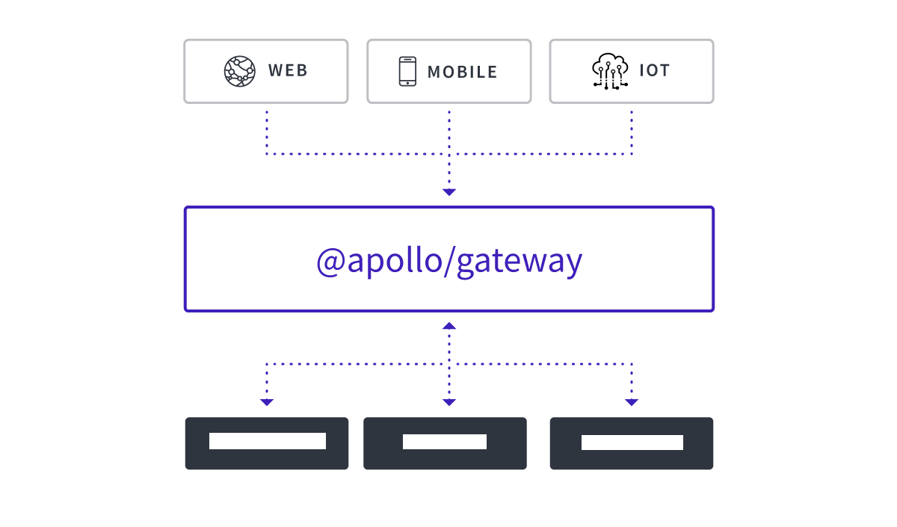
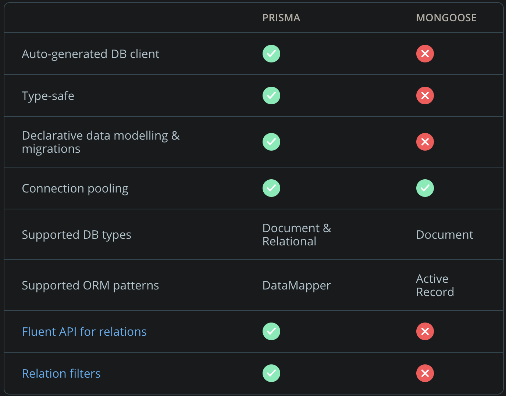

## Authorization strategies using Apollo Federation

### Introduction
This repository demonstrates various authorization strategies within the GraphQL layer, namely around resolvers/models.

The sample exposes a [single data graph](https://principledgraphql.com/integrity#1-one-graph) that provides a unified interface for querying the backend data sources.
The data sources spin up a local MongoDB upon startup of the microservices, which reside in the [services folder](services)
(more info on how this is done below).



### Data layer choices
[ORMs come with a performance-hit](https://medium.com/@bugwheels94/performance-difference-in-mongoose-vs-mongodb-60be831c69ad) and are strictly speaking unnecessary...

In saying that: [Mongoose](https://mongoosejs.com/) was the ORM employed with this proj. for familiarity's sake. Also for 
more compelling reasons as covered by marketing (simplicity, reducing boilerplate and (hopefully) errors when validating DB access.)

Special consideration was also given to [Prisma](https://www.prisma.io/docs/get-started/01-setting-up-prisma-new-database-JAVASCRIPT-a002/)
and is the [ORM of choice for GraphQL evangelists](https://www.howtographql.com/graphql-js/0-introduction/)



## Authorization

The strategies outlined below use public/private keys and a corresponding JWT stored in the [helpers](./services/helpers) folder.
The JWT uses the following custom claims in it's payload when discussing the auth(z) strategies, as a naive implementation:

`  "userId": "kek",
  "can-write-posts": "true",
  "is-admin": "true"`

Whilst the token was created to include an expiration, this is ignored for debugging purposes when [requests are validated
by the custom middleware](/services/helpers/jwt-validator.js):

`const jwtVerifyOptns = {ignoreExpiration:true};`
  
If you wish to expand the JWT with more sensical data, the [secret key](./services/helpers/secret-key.txt) must be used to re-sign
the JWT. Various utilities exist to do so, but I found ShaunR's [excellent utility as an independent offshoot](https://wowonline.visualstudio.com/Trader/_git/TokenUtility)
of the Trader repo to be most useful here (WPF however, so required Windows).

This repo primarily focuses on how to set up authorization for your schema once you know about the user making the request
(so assumes authentication has already taken place). It will therefore focus on what the user has permission to do or see.

### Strategies - Authorization at the schema-level

Once we've authenticated the user, the most basic form of auth(z) would be to deny their query permission to do 
anything at all, based on absence of some role. If users are blocked this way, no fields will be publicly queryable.

We would want to do this only on very restrictive environments where there is no public access to the schema or any fields, 
like an internal tool or maybe an independent micro service that we don’t want exposed to the public, by modifying the
context function of [a micro-service](./services/PostService/src/index.js):

            context: ({req, res, context}) => {
                //collection of posts by the user which match the userId custom claim
                let postCollection = PostModel.fetchPostByUserId(context.req.user.userId)

                // if postCollection empty, optionally block user from querying posts
                // we could also check other custom claims here, ie roles
                if (postCollection == null || postCollection.length === 0) {
                    return {
                        success: false,
                        error: {
                            status: 400,
                            message: 'Unauthorized'
                        }
                    }
                }

                return {
                    req,
                    res,
                    context
                }
    
### Strategies - Authorization at the resolver level

Schema auth(z) may be useful in specific instances, but more commonly, GraphQL will have some fields that need to be public.
An example would be to for instance show a list of posts from the user, but limit visibility of the comments to an admin
or somebody with the appropriate custom claim.

Individual field resolvers in GraphQL servers have granular control over data. In that vein, the remaining strategies will
discuss how to use the context object.

This example utilizes the status quo regarding the custom claims from the JWT, and can be found in the 
[Mutation resolver for creating posts](./services/PostService/src/Post/mutationresolvers/createPost.js)

    // get decoded data from token
    const tokenData = context.req.user;

    // return error if there's no token attached to this request
    // because we need this to check if user can create a post
    if(!tokenData) {
        return {
            success : false,
            error : {
                status : 400,
                message : 'Authorization token required'
            }
        }
    }

    // Assuming there're isAdmin/canWritePosts fields that denotes appropriate admin status
    const { isAdmin, canWritePosts }  = tokenData

    if (!isAdmin || !canWritePosts) {
        return {
            success : false,
            error : {
                status : 401,
                message : 'You have no permissions to create posts'
            }
        }
    
The `if(!tokenData) {` check looks at the context as shared from the gateway. The benefit of doing authorization like this 
is that we can short-circuit our resolvers and not even call lookup functions when we don’t have permission to use them, 
limiting the possible errors that could expose sensitive data.

The return values are down to individual choice - In this case we return an explicit error that's passed back to the client.
Perfectly valid alternatives include returning an empty array or `null`.

Because our resolvers have access to everything in the context, an important question we need to ask is how much information 
we want in the context. For example, we don’t need the user’s id, name, or age (at least not yet). It’s best to keep things 
out of the context until they’re needed, since they’re easy to add back in later.

### Strategies - Authorization in data models

This is the Apollo-recommended strategy of embedding auth(z) in GraphQL, as it allows us to make resolvers a thin routing
layer, placing all of our business logic in one place. Schemas may have logic in several places to fetch identical data,
hence data models being the method of choice when attempting to avoid duplication

We implement this by adding our models to the context (as per the user information) in almost exactly the same way 
we did earlier with the posts:

            context : ({req,res,context}) => {
                
                const token = context.req.user
                //fetch user, method will require a small refactor
                const user = fetchUserById(null, token.userId, null)
                return {
                    req,
                    res,
                    context,
                    models: {
                        //function defined below
                        User: generateUserModel({ user }),
                        ...
                    }
                }
            }
            
And then generating our models with a function (requiring a small refactor from current implementation), as per:

    export const generateUserModel = ({user}) => ({
    
        getAllUser: () => { /* fetching/transform logic for all users */
        },
        
        getUserById: (id) => { /* fetching/transform logic for a single user */
        },
        
        insertUser: (userInfo) => { /* fetching/transform logic for inserting a new user*/
        },
        
        updateUser: (userId,userInfo) => { /* fetching/transform logic for the update of existing users */
        },
    });
          
Now any model method in `User` has access to the same `user` information that resolvers already had, allowing us to 
refactor the `getAllUser` method to do the permissions check directly rather than having to put it  in the resolver.

    getAllUser: () => {
	    if(!user || !user.roles.includes('is-admin')) return null;
	    return this.find({}).exec();
    }

###  Dependencies

Local MongoDB installation required (not npm install mongoDB)

### Set-up

`User Service`

```
 $ cd services/UserService
 $ npm install
```

`Post Service`

```
$ cd services/PostService
$ npm install
```

` Comment Service `

```
$ cd services/CommentService
$ npm install
```

` Gateway `

```
$ npm install
```

This one-time setup will install all of the dependencies for the gateway and each underlying service

#### Running Gateway/Microservices

```
$ npm run start-services
$ npm run start-gateway
```

#### Running Queries in Playground

Navigating to http://localhost:4000/ which is the default endpoint for the [GraphQL Playground](https://github.com/prisma-labs/graphql-playground): 
the interactive in-browser IDE.

The [jwt-validator](./services/helpers/jwt-validator.js) is employed as middleware on every microservice hitherto, ergo 
we'll need to inject the Authorization header in the 'HTTP HEADERS' section of the IDE on every request, as per:

{"Authorization": "Bearer [paste token from here](./services/helpers/jwt.txt)"}

Checking the [Sample queries](./sample-queries.txt) for examples of queries and mutations.
